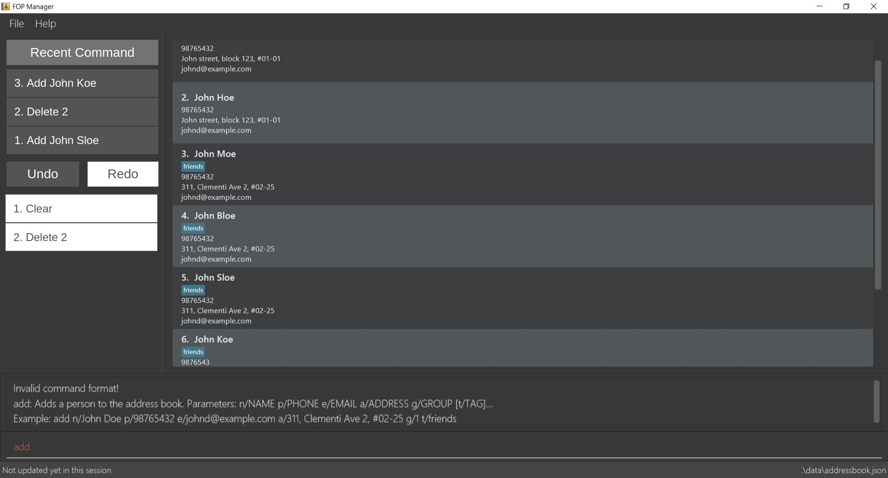

= FOP Manager
ifdef::env-github,env-browser[:relfileprefix: docs/]

https://travis-ci.org/CS2113-AY1819S2-T08-4/main[image:https://travis-ci.org/CS2113-AY1819S2-T08-4/main.svg?branch=master[Build Status]]

ifdef::env-github[]

endif::[]

ifndef::env-github[]

endif::[]

* This is a desktop Address Book application. It has a GUI but most of the user interactions happen using a CLI (Command Line Interface).
* It is a Java application targeted at *Project Directors* organizing the *School of Computing Freshman Orientation Camp*.
* This application is a useful tool to manage the contacts of participating Freshmen, OGLs and others. Its features include:
** An easy to use GUI with a list panel displaying participant details
** Listing of participants by their 3 categories (Freshmen, OGLs and others)
** Grouping of participants into groups, stored within houses
** Viewing graphs of the statistics of the camp participants
** Random group allocation of participants
** Exporting participant information (by whole list, by Freshmen list or by OGL list) from the application to a readable format (Excel)
** Importing participant information from Excel file to FOP Manager

== Site Map

* <<UserGuide#, User Guide>>
* <<DeveloperGuide#, Developer Guide>>
* <<AboutUs#, About Us>>
* <<ContactUs#, Contact Us>>

== Acknowledgements

* FOP Manager is built upon the awesome https://github.com/se-edu/[AddressBook-Level4] codebase by the SE-EDU initiative.
* Some parts of this application were inspired by the excellent http://code.makery.ch/library/javafx-8-tutorial/[Java FX tutorial] by _Marco Jakob_.
* Libraries used: https://github.com/TestFX/TestFX[TextFX], https://github.com/FasterXML/jackson[Jackson], https://github.com/google/guava[Guava], https://github.com/junit-team/junit5[JUnit5]

== Licence : link:LICENSE[MIT]
